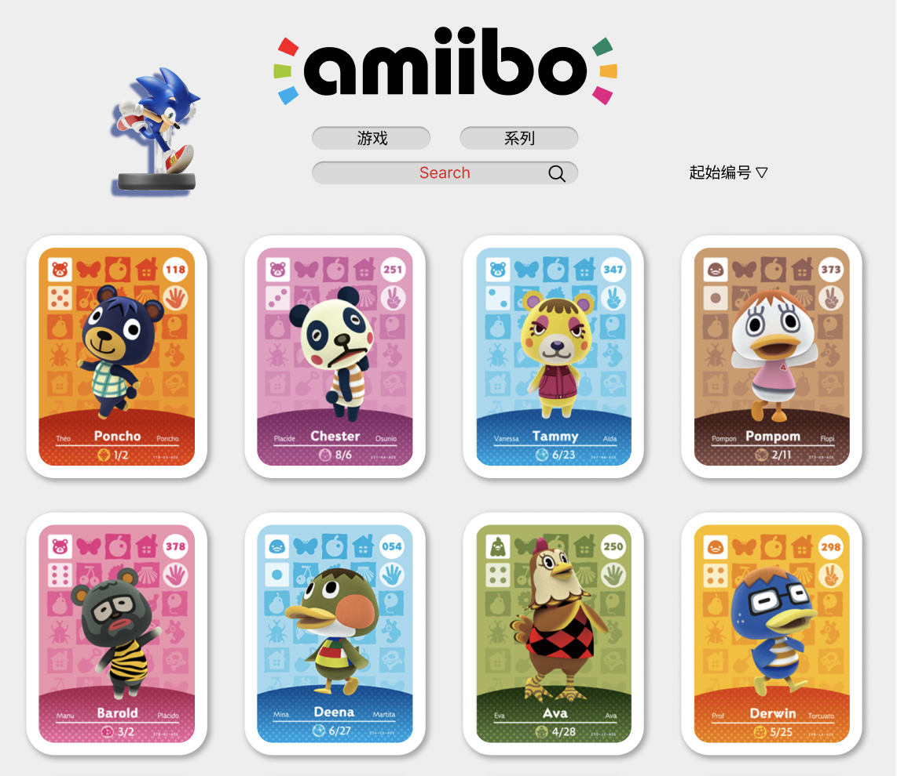

# AmiiboWIKI

### Hi~ o(_￣ ▽ ￣_)ブ\_\_\_欢迎你来！

> 项目已完成重构<br>
> 现由 Vite Vue3 TS 强力驱动


使用 vue 开发的 amiibo 卡片展示站

```markdown
- Vue3 易学易用，性能出色，适用场景丰富的 Web 前端框架
- Vite 下一代的前端工具链
- Pinia 值得你喜欢的 Vue Store
- Axios 基于 Promise 面向浏览器和 node.js 的 HTTP 客户端
- Lodash 一个提供模块化、性能和额外功能的现代 JavaScript 实用库
- ESLint 可扩展的 JavaScript 和 JSX 代码检查工具
- Prettier 固执的代码格式化器
- Sass 让 CSS 再次变得有趣
- TypeScript 一种具有类型语法的 JavaScript
- GitHub Actions 从创意到生产,使工作流程自动化
```

计划开发流程如下：

- [x] 开始动手(不去做一切都是空想！！！)
- [x] 基本图片展示功能，数据请求及处理
- [x] 移动端适配
- [x] 卡片人物详情模块
- [x] 图片懒加载（防抖处理）
- [x] 重构布局，美化界面(使用 Vue 重构，增加通过系列查询功能)
- [x] 使用 Vite+Vue+TS 进行重构
- [ ] 增加后端，开发注册、登陆、评论等社区功能
- [ ] 增加消息动态栏，显示用户发布的动态（amiibo 交流信息）
- [ ] 移植为小程序
- [ ] 使用 Hybrid App 技术开发对应 ios，Android 应用

---

_本项目涉及到的 amiibo 图片版权归日本任天堂公司所有，此处使用仅为学习，如有侵权请联系删除_

所用 API 来自 https://www.amiiboapi.com
