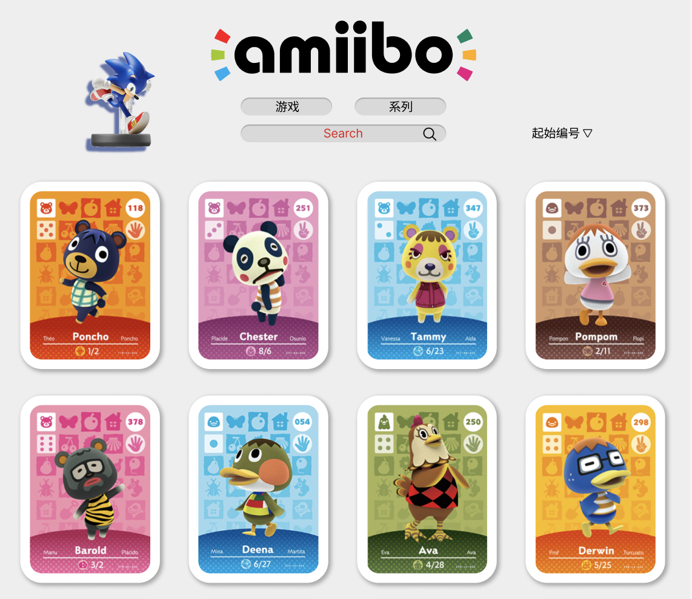

# AmiiboWIKI

### Hi~ o(*￣▽￣*)ブ___欢迎你来！

使用vue开发的amiibo卡片展示站；

目前功能较为简陋，计划开发流程如下：
- [x] 开始动手(不去做一切都是空想！！！)
- [x] 基本图片展示功能，数据请求及处理
- [x] 移动端适配
- [x] 卡片人物详情模块
- [x] 图片懒加载（防抖处理）
- [x] 重构布局，美化界面(使用Vue重构，增加通过系列查询功能，已完成50%)
- [ ] 增加后端，开发注册、登陆、评论等社区功能
- [ ] 增加消息动态栏，显示用户发布的动态（amiibo交流信息）
- [ ] 移植为小程序
- [ ] 使用Hybrid App技术开发对应ios，Android应用  

---

*本项目涉及到的amiibo图片版权归日本任天堂公司所有，此处使用仅为学习，如有侵权请联系删除*

所用API来自 https://www.amiiboapi.com